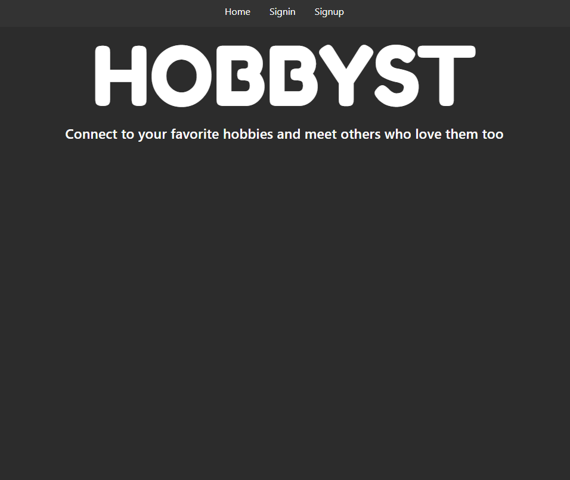
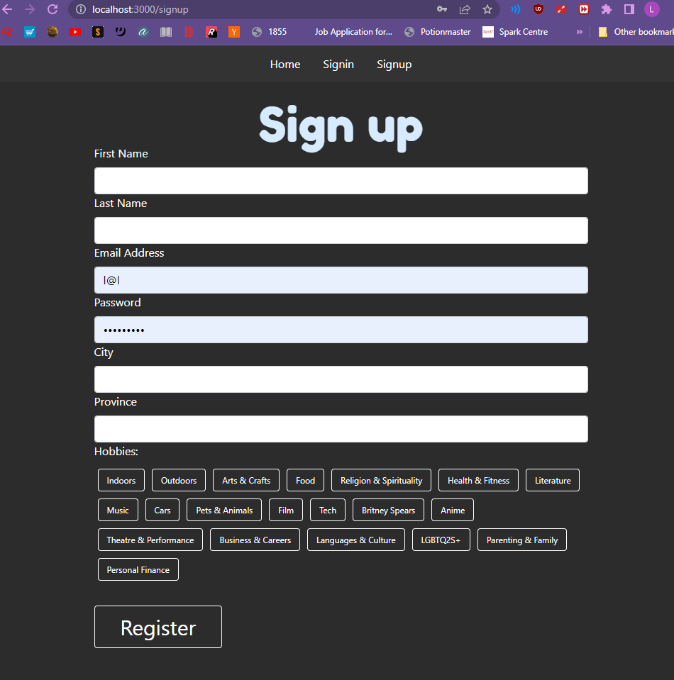

# Have you ever wanted to make friends based on your hobby and don't know where to begin? Join Hobbyst!

## Add your hobbies, and find events related to those hobbies! Make your own event and watch the new collections trickle in.

## Below you will find screenshots with functionality, a little about the team, the technologies used.

### Technologies Used: MERN STACK (MongoDB/Mongoose, Express, React, Node) with full CRUD functionality, GoogleMaps API.

### Lila: the person writing this README is super cool. She loves hiking, trying new things, being outside and reading books to expand her EQ. Since Corona started, and since graduating university, she's found it very hard to make friends. That was why she found this project very interesting and personal.

### Andrew:

### Basheer: "Hello friend. I think that human connection is one of the most important things in life and the most valued moments in our lives are those we share with others. Im happy to be a part of this project which aims to help humans connect"

### Hammad: I like reading and listening to audio books

Our front pagee introduces what the webapp is about

To start, click 'sign up'. After creating your profile, you will be logged in.

Clicking your 'name' in the top nav bar, will take you to your profile, showing you all the events you've created. You can also edit your profile on this page, whether you want to change your name, the hobbies you're interested in, etc.

Clicking on 'All Hobbies' shows you a list of all the hobbies.

If you click on the image or text of a hobby, you're directed to all the events that exist for that hobby.

If you click one of the event titles, it'll give you the information about the event, including location, time, etc.

If you want to create an event, click the 'New Event' in the Nav bar. On this page, please enter the photo as a URL (you can upload your picture to Imgur and then copy/paste the link and put it in the field).

### Icebox Items:

- Real Time messaging, so you can communicate with other event creators
- RSVP to other people's events
- Search functionality
- Event Image upload

